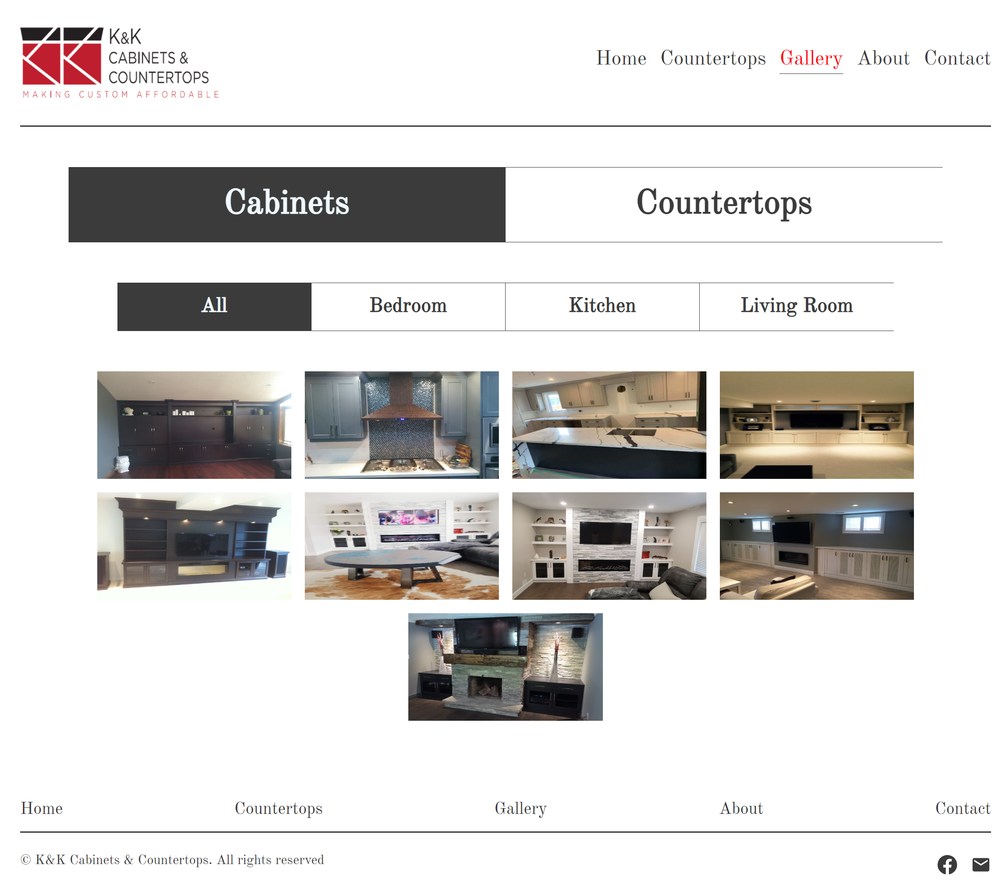

# K&K Cabinets & Countertops Company Website

This is the K&K Cabinets & Countertops company's website.

## Description

- K&K Cabinets & Countertops is a company that is based in Kitchener, ON, which provides design & installation solutions for top quality cabinets & countertops. The company has been serving local clients for more than 20 years and is currently led by head designer Zenia Horton.
- The company needed a remake of their official website back in 2020 and was collecting ideas from many web developers by hosting a web design contest.
- As a participating student who was learning web development at the time, this web design ended up taking 2nd place in the contest.
- This is actually an improved version of my original design, as I have become a better web developer over the years and I thought I would be able to recreate this web design with better & more efficient code.

## Table of content

- [Installation](#installation)
- [Usage](#usage)
- [Credits](#credits)
- [License](#license)

## Installation

- [Click here to go to the website](https://branbao1995.github.io/kkproject-2)

## Usage

- Link to the Github Repository [https://github.com/BranBao1995/kkproject-2](https://github.com/BranBao1995/kkproject-2)

- This is the home page:

  - 

- This is the Countertops page, users can click on the images to see all available countertops material selections:

  - 

- This is the gallery page, users can see all works done by the company:

  - 

- This is the about page where brief introduction of the company and the company's head designer are provided:

  - 

- This is the contact page of the portfolio:

  - 

## Credits

- Author's Github Profile: [https://github.com/BranBao1995](https://github.com/BranBao1995)
